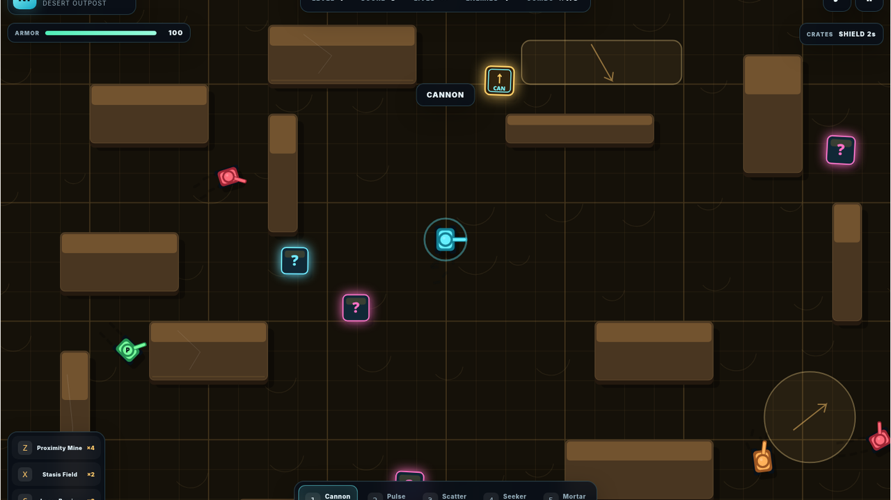
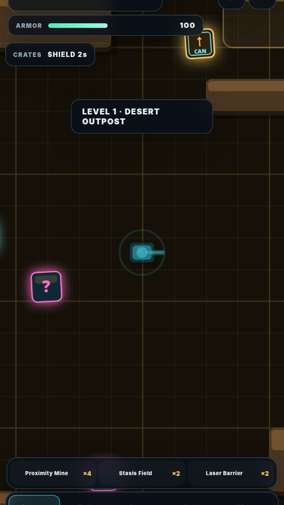

# Neon Tank Arena V1

Neon Tank Arena is an installable, offline-ready top-down tank arena built with TypeScript, Vite, and the HTML Canvas API. Fight deterministic procedural arenas, collect temporary bonuses, build permanent weapon upgrades, deploy tactical gadgets, and defeat the Siege Titan boss encounters.

Play the published game: [asamarus.github.io/neon-tank-arena](https://asamarus.github.io/neon-tank-arena/)





## Features

- Canvas renderer with a camera-following 1,800 x 1,200 world at level 1, expanding up to 2,500 x 1,750.
- Fixed-step simulation at 60 updates per second with a capped frame delta.
- Deterministic level generation: the level number seeds walls, hazards, spawns, crates, and the active theme.
- Five weapons, six upgradeable stats per weapon, temporary power-ups, and three deployable gadgets.
- Twelve regular enemy archetypes, elite variants, and a three-phase Siege Titan boss every fifth level.
- Keyboard, mouse, pen, touch, and responsive mobile twin-stick input.
- Synthesized Web Audio effects with no external audio files.
- Installable PWA with a versioned service worker, offline shell, runtime caching, and safe update activation.
- No runtime framework or production dependency; Vite and TypeScript are development tools only.

## Quick start

Requirements: Node.js 20 or newer and npm.

```bash
npm install
npm run dev
```

Open the local URL printed by Vite. For a production build:

```bash
npm run build
npm run preview
```

`npm run build` runs the strict TypeScript compiler before creating the Vite bundle in `dist/`.

## Complete game manual

### Objective and campaign flow

1. Select **START NEW GAME**. This resets the score and all permanent weapon ranks, then starts at level 1.
2. Destroy every enemy in the arena. The enemy counter reaches zero when the level is cleared.
3. A level-clear bonus is awarded, health is restored, and the next level begins automatically after a short transition.
4. Every fifth level is a Siege Titan encounter with escort tanks instead of a regular wave.
5. The campaign has unlimited respawns. Taking lethal damage costs 150 score, then respawns the tank after about 1.45 seconds with full armor and a short shield.

The score rewards fast kill chains, multikills, critical hits, ricochets, long shots, point-blank hits, environmental kills, gadget kills, flawless streaks, comeback kills, elite tanks, and bosses. The combo multiplier rises by 0.5 every three consecutive kills and caps at x8.0; taking damage breaks the current combo unless Combo Lock is active.

### Controls

| Action         | Desktop                           | Mobile / touch                          |
| -------------- | --------------------------------- | --------------------------------------- |
| Move           | `WASD` or arrow keys              | Drag the left virtual stick             |
| Aim            | Move the mouse or pen             | Drag the right virtual stick            |
| Fire           | Hold left mouse button or `Space` | Pull the right stick far enough to fire |
| Select weapon  | `1`-`5`, or `Q` / `E` to cycle    | Tap a weapon button                     |
| Proximity Mine | `Z`                               | Tap **Proximity Mine**                  |
| Stasis Field   | `X`                               | Tap **Stasis Field**                    |
| Laser Barrier  | `C`                               | Tap **Laser Barrier**                   |
| Pause / resume | `P` or `Esc`, or the pause button | Tap the pause button                    |
| Sound          | Sound button in the HUD           | Sound button in the HUD                 |

On touch screens, the left half of the canvas owns movement and the right half owns aiming. Two simultaneous pointers provide the twin-stick experience. Touch controls are drawn only when the device reports a coarse pointer.

### Weapons

The HUD shows each weapon’s current permanent upgrade total as `Lx/30`. Weapon switching is immediate; firing uses the selected weapon’s aim direction.

| Key | Weapon  | Base behavior                                | Base damage / cooldown |
| --- | ------- | -------------------------------------------- | ---------------------- |
| `1` | Cannon  | Heavy shell with one wall bounce             | 38 / 0.42 s            |
| `2` | Pulse   | Very fast single pulse projectile            | 10 / 0.095 s           |
| `3` | Scatter | Seven-pellet spread at close-to-medium range | 12 per pellet / 0.68 s |
| `4` | Seeker  | Homing rocket with area damage               | 52 / 0.95 s            |
| `5` | Mortar  | Slow shell with a large explosion radius     | 72 / 1.16 s            |

Weapon upgrades are permanent for the current campaign. Each of the six stats can reach rank 5, for a maximum of 30 ranks per weapon:

- **Damage Core:** +11% damage per rank.
- **Cycling Array:** up to 6% shorter cooldown per rank.
- **Velocity Coil:** +7% projectile speed per rank.
- **Specialist Mod:** improves that weapon’s unique behavior.
- **Critical Matrix:** +4% critical-hit chance per rank.
- **Sustained Payload:** increases range and payload size and adds piercing at higher ranks.

### Gadgets

Gadget charges reset at the start of each level. The starting loadout is four mines, two stasis fields, and two laser barriers; later campaign levels can increase the charge allowance.

| Gadget                   | Effect                                                                                                                                                                               |
| ------------------------ | ------------------------------------------------------------------------------------------------------------------------------------------------------------------------------------ |
| **Proximity Mine** (`Z`) | Drops at the tank, arms after 0.45 seconds, and detonates when an enemy enters its trigger radius. The blast damages enemies in a 122-unit radius and persists for up to 30 seconds. |
| **Stasis Field** (`X`)   | Places a 158-unit field about 115 units in front of the turret. Enemies inside are slowed/stunned for 8.5 seconds.                                                                   |
| **Laser Barrier** (`C`)  | Places a 210-unit-wide laser segment about 105 units ahead for 7.5 seconds. It deletes enemy projectiles crossing it and damages enemies that touch it.                              |

### Bonus crates and pickups

Question-mark crates can be collected by contact or opened by a player projectile or explosion. Each pickup adds 75 score. Elite enemies and bosses guarantee bonus drops; bonus crates also appear periodically during a level.

| Pickup          | Effect                                                                             |
| --------------- | ---------------------------------------------------------------------------------- |
| Armor Repair    | Restores 48 armor; if already full, awards 250 score instead.                      |
| Energy Shield   | Full invulnerability for 6 seconds.                                                |
| Front Deflector | Reduces or nullifies damage arriving inside the forward turret arc for 14 seconds. |
| Rapid Fire      | Faster firing for 9 seconds.                                                       |
| Turbo Drive     | Faster movement for 9 seconds.                                                     |
| Power Shot      | Increased damage for 9 seconds.                                                    |
| Reactive Armor  | Reduces incoming damage for 12 seconds.                                            |
| Vampiric Rounds | Enables health recovery from weapon damage for 12 seconds.                         |
| Crate Magnet    | Pulls nearby crates from up to 360 units away for 14 seconds.                      |
| Time Warp       | Slows the combat simulation for 10 seconds.                                        |
| Overcharge      | Adds multi-shot behavior for 10 seconds.                                           |
| Gadget Refill   | Adds two charges to every gadget, subject to the refill cap.                       |
| EMP Nova        | Stuns regular enemies for 4.5 seconds or a boss for 2.6 seconds.                   |
| Combo Lock      | Preserves the kill combo window for 12 seconds.                                    |
| Score Cache     | Adds 500 score plus 50 times the current level.                                    |
| Weapon Roulette | Immediately switches to a random different weapon.                                 |

Gold upgrade crates contain a predetermined weapon/stat upgrade. Collecting one adds a rank and 150 score; collecting a crate for an already-maxed stat awards 400 score instead. Upgrade offers favor the currently equipped weapon but can target any weapon.

### Arenas and hazards

Each level is generated from its level number, so replaying the same level number produces the same layout. Walls provide cover; some are destructible. The world grows with campaign progress and contains a protected central spawn area.

The six themes rotate in order:

| Theme          | Hazard   | Gameplay effect                                      |
| -------------- | -------- | ---------------------------------------------------- |
| Desert Outpost | Wind     | Pushes tanks and slightly reduces movement speed.    |
| Cryo Fortress  | Ice      | Increases speed but greatly reduces turning control. |
| Iron Foundry   | Conveyor | Pushes tanks along the marked conveyor direction.    |
| Orbital Grid   | Electric | Periodically deals damage while powered.             |
| Jungle Relay   | Sludge   | Reduces movement speed and turning control.          |
| Magma Citadel  | Lava     | Slows movement and deals periodic damage.            |

Hazard areas are visibly telegraphed on the floor. Enemies can also be damaged by environmental hazards, which can award the **ENVIRONMENTAL** score bonus.

### Enemy roster

Regular waves grow from three enemies and scale up to a maximum of 100. Enemy weapon strength follows both the map level and a portion of the player’s matching weapon upgrades, so later arenas remain dangerous even when one weapon is highly upgraded.

| Enemy          | Unlock | Behavior / threat                                              |
| -------------- | -----: | -------------------------------------------------------------- |
| Scout          |      1 | Fast orbiting shooter.                                         |
| Hunter         |      1 | Pressures the player at medium range.                          |
| Pulse Striker  |      1 | Rapid pulse fire; guaranteed in regular encounters.            |
| Sniper         |      2 | Kites at long range with accurate shots.                       |
| Heavy          |      3 | Slow, durable tank with triple fire.                           |
| Mortar Carrier |      3 | Long-range area fire; guaranteed from level 3.                 |
| Rocketeer      |      4 | Fires slow homing rockets.                                     |
| Bulwark        |      4 | Durable pressure tank.                                         |
| Cloaker        |      5 | Periodically fades from view while orbiting.                   |
| Mine Layer     |      6 | Places proximity mines; guaranteed from level 6.               |
| Repair Drone   |      7 | Repairs the most damaged nearby ally; guaranteed from level 7. |

Elite tanks have improved stats, award double base kill score, and can drop an upgrade crate. They are marked with a stronger aura in the arena.

### Siege Titan boss

Levels 5, 10, 15, and so on contain a **SIEGE TITAN** plus escort tanks. The Titan has three health phases:

- **Phase 1:** standard boss weapon pattern.
- **Phase 2:** begins below 66% health and summons three reinforcements.
- **Phase 3 / Overdrive:** begins below 33% health and summons four reinforcements while increasing its attack tempo.

Defeating the Titan awards triple base kill score, a boss bonus, multiple bonus crates, and multiple upgrade crates. Use Stasis to create breathing room, place a Barrier between the Titan and your retreat path, and save EMP for the reinforcement waves.

## Technical architecture

```text
src/main.ts                 Application entry point
src/game/Game.ts            Fixed-step simulation, campaign, combat, pickups
src/game/Arena.ts           Procedural layouts, collisions, terrain hazards
src/game/GameRenderer.ts    Canvas rendering and HUD/game overlays
src/game/WeaponSystem.ts    Weapon profiles, permanent upgrades, enemy parity
src/game/config.ts          Weapons, enemies, bonuses, themes, gadgets
src/input/InputManager.ts   Keyboard, mouse, pen, and pointer/touch input
src/audio/SynthAudio.ts     Web Audio API sound synthesis
src/pwa/PwaController.ts    Install prompt, connectivity, and SW updates
public/sw.js                Versioned offline shell and runtime cache
public/manifest.webmanifest PWA identity, icons, screenshots, and shortcuts
```

The simulation uses pooled bullets and effects to reduce allocation pressure. Rendering is adaptive: the device pixel ratio is capped lower on coarse-pointer devices and low-memory devices.

## Project files and commands

| Command                                        | Purpose                                                 |
| ---------------------------------------------- | ------------------------------------------------------- |
| `npm run dev`                                  | Start the Vite development server.                      |
| `npm run build`                                | Type-check and create the production bundle in `dist/`. |
| `npm run preview`                              | Serve the production bundle locally.                    |
| `npm run release:version -- <version> <notes>` | Update the PWA build markers in `public/`.              |

Before testing offline behavior, run a production build, serve it from HTTPS or localhost, load the game once, and then use the browser’s offline mode or disconnect the network. Service-worker behavior differs from Vite’s development server, so offline installation should always be verified against the built site.

## License

Neon Tank Arena is released under the [MIT License](./LICENSE).
